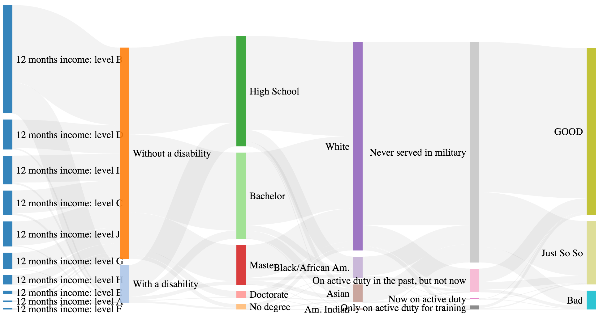

"In the name of God, I, take you, to be my husband/wife, to have and to hold from this day forward, for better or worse, for richer or poorer, in sickness and in health, to love and to cherish all the days of my life. This is my solemn vow."

<div style="width:400px; height=300px">

</br>


</div>

</br>
</br>

So you still believe in fairy tale?

Time to wake up.

# 1 Introduction

<p>
In this project, we seek to find out features that may affect people’s marriage status. Are they truly loyal to their wedding vows? Or are there certain patterns or factors that may lead their marriage to end?
</p>

We choose 'marital status' and 'number of times married' as measurement of a person's performance on marriage. By relating this to other factors, such as income, eduction level, or health status, we wish to find some patterns upon them.

We may find answers for some interesting questions, for example, does high income help people keep marriage steady? Should we listen to parents’ suggestions to break up with boyfriend who has a severe disease or disability? Is it a good idea to get married with a person who has a doctor degree?

Our goal is to find related factors that may bring negative effects to marriage, and avoid them. 

# 2 Data Selection
### 2.1 Marriage Performance
We tag marriage performance by two measurement: 'Marital Status' and 'Number of Times Married'.

a. fac = 1 (Good Marriage Performance): the number of times married is one and the marital status is 'not divorced' now, we think this person does very well in marriage.

b. fac = 2 (Poor Marriage Performance): the number of times married is one and the marital status is 'divorced' now, or the number of times is two and the marital status is 'not divorced' now, we think this person performs not bad in marriage.

c. fac = 3 (Inferior Marriage Performance): the number of times married is three, or this number is two and the marital status is 'divorced' now, we think this person does very poor in marriage.

```{r eval=FALSE}
databad <- data_ori[(MAR == 3 | MARHT >= 2)]
datagood <- data_ori[(MAR != 3 & MARHT < 2)]

#Define a good marriage attitude
datagood[, fac := 1, ]

#Define a poor marriage attitude
databad1 <- databad[!(MARHT >= 3 | (MARHT == 2 & MAR == 3))]
databad1[, fac := 2, ]

#Define a inferior marriage attitude
databad2 <- databad[MARHT >= 3 | (MARHT == 2 & MAR == 3)]
databad2[, fac := 3, ]

data_f <- rbind(datagood, databad1, databad2)
```

### 2.2 Disability Record

a. DIS = 1: with a disability
b. DIS = 2: without a disability

```{r eval=FALSE}
data_dis <- data_final[!is.na(DIS), list(DIS, fac)]
```

### 2.3 Race Code

a. RAC1P = 1: White alone
b. RAC1P = 2: Black or African American alone
c. PAC1P = 3: American Indian alone
d. PAC1P = 4: Asian alone

```{r eval=FALSE}
data_RAC1P <- data_final[RAC1P==1|RAC1P==2|RAC1P==3|RAC1P==6, list(RAC1P, fac)]
```

### 2.4 Educational Attainment
a. SCHL = 1: No schooling completed
b. SCHL = 16: Regular high school diploma
c. SCHL = 21: Bachelor's degree
d. SCHL = 22: Master's degree
e. SCHL = 24: Doctorate degree

```{r eval=FALSE}
data_SCHL <- data_final[SCHL==1|SCHL==16|SCHL==21|SCHL==22|SCHL==24, list(SCHL, fac)]
```

### 2.5 Wages or Salary Income Past 12 Months

```{r eval=FALSE}
data_WAGP <- data_final[!is.na(WAGP), list(WAGP, fac)]
```


### 2.6 Military Service
a. MIL = 1: Now on active duty
b. MIL = 2: On active duty in the past, but not now
c. MIL = 3: Only on active duty for training in Reserves/National Guard 
d. MIL = 4: Never served in the military

```{r eval=FALSE}
data_MIL <- data_final[!is.na(MIL), list(MIL, fac)]
```

# 3 Weight Incorporation

We removed all NA and balanced weight for the sample data.

```{r eval=FALSE}
data_all_var <- data_final[!is.na(DIS) & (RAC1P==1|RAC1P==2|RAC1P==3|RAC1P==6) & (SCHL==1|SCHL==16|SCHL==21|SCHL==22|SCHL==24) & !is.na(WAGP) & !is.na(MIL), list(DIS, RAC1P, SCHL, WAGP, MIL, PWGTP, fac)]
```

```{r eval=FALSE}
#load disability file
allvar <- fread('updated_data_all_var.csv') 
allvar <- data.frame(allvar)

#clustering based on wage
allvar$WAGP <- as.array(kmeans(allvar$WAGP, 10, nstart = 20)$cluster)
#head(allvar)

# 1.DIC 2. RAC1P  3.SCHL 4.WAGE 5.MIL 6.PWGTP 7.fac

#######
#1.wage -> dis
f.dis <- function(col1){ 
  a <- sort(unique(allvar[,col1]))
  b <- sort(unique(allvar$DIS))
  results <- matrix(NA, nrow = length(a), ncol = length(b) )
  cou = 1
  for (i in 1:length(a)){
    flow <- count(allvar[which(allvar[,col1]==a[i]),],DIS, wt = PWGTP)
    colnames(results) <- sort(b)
    rownames(results) <- sort(a)
    results[cou,] <-flow$n
    cou <- cou + 1
  }
  return(results)
}

# Wage to fac
f.dis(4)

#######
#2.dis -> edu
unique(allvar$DIS)
f.edu <- function(col1){ 
  a <- sort(unique(allvar[,col1]))
  b <- sort(unique(allvar$SCHL))
  results <- matrix(NA, nrow = length(a), ncol = length(b) )
  cou = 1
  for (i in 1:length(a)){
    flow <- count(allvar[which(allvar[,col1]==a[i]),],SCHL, wt = PWGTP)
    colnames(results) <- sort(b)
    rownames(results) <- sort(a)
    results[cou,] <-flow$n
    cou <- cou + 1
  }
  return(results)
}

# Dic to edu
f.edu(1)

#######
#3. edu -> race
unique(allvar$SCHL)
unique(allvar$RAC1P)
f.rac <- function(col1){ 
  a <- sort(unique(allvar[,col1]))
  b <- sort(unique(allvar$RAC1P))
  results <- matrix(NA, nrow = length(a), ncol = length(b) )
  cou = 1
  for (i in 1:length(a)){
    flow <- count(allvar[which(allvar[,col1]==a[i]),],RAC1P, wt = PWGTP)
    colnames(results) <- sort(b)
    rownames(results) <- sort(a)
    results[cou,] <-flow$n
    cou <- cou + 1
  }
  return(results)
}

# Edu to race
f.rac(3)

#######
#4. race -> millitary
unique(allvar$RAC1P)
unique(allvar$MIL)
f.mil <- function(col1){ 
  a <- sort(unique(allvar[,col1]))
  b <- sort(unique(allvar$MIL))
  results <- matrix(NA, nrow = length(a), ncol = length(b) )
  cou = 1
  for (i in 1:length(a)){
    flow <- count(allvar[which(allvar[,col1]==a[i]),],MIL, wt = PWGTP)
    colnames(results) <- sort(b)
    rownames(results) <- sort(a)
    results[cou,] <-flow$n
    cou <- cou + 1
  }
  return(results)
}

# race to millitary
f.mil(2)

########################################
# each variable numbers flow to fac
f <- function(col1){ #col1 ->col2
  a <- sort(unique(allvar[,col1]))
  b <- sort(unique(allvar$fac))
  results <- matrix(NA, nrow = length(a), ncol = length(b) )
  cou = 1
  for (i in 1:length(a)){
    flow <- count(allvar[which(allvar[,col1]==a[i]),],fac, wt = PWGTP)
    colnames(results) <- sort(b)
    rownames(results) <- sort(a)
    results[cou,] <-flow$n
    cou <- cou + 1
  }
  return(results)
}
```

# 4 Data Visualization

```{r, echo=FALSE}
##setup environment
library(data.table)
library(plotly)
library(ggplot2)
library(networkD3)
library(extracat)
require(rCharts)
require(plyr)


#set direction
setwd("~/Desktop/ADS/Fall2016-proj1-grp10/")

#import data
data <- fread('data/updated_data_all_var.csv')
data$fac <- as.factor(data$fac)
data$DIS <- as.factor(data$DIS)
data$RAC1P <- as.factor(data$RAC1P)
data$SCHL <- as.factor(data$SCHL)
data$WAGP <- as.factor(data$WAGP)
data$MIL <- as.factor(data$MIL)

data_raw = data
data$WAGP <- as.array(kmeans(data$WAGP, 10, nstart = 20)$cluster)


#colnames(data)  #"DIS"   "RAC1P" "SCHL"  "WAGP"  "MIL"   "PWGTP" "fac"  

#subset data
subdata = data[sample(1:dim(data)[1], as.integer(dim(data)[1]/10), replace=FALSE),]
data_raw = data_raw[sample(1:dim(data_raw)[1], as.integer(dim(data_raw)[1]/10), replace=FALSE),]
```

### 4.1 'For Richer or Poorer' --- Wages VS Marriage Performance 

#### a. Boxplot
```{r, echo=TRUE}
#plot
##wages: 
# 1.box-plots for wage
p <- plot_ly(ggplot2::diamonds, y = data_raw$WAGP  , color = data_raw$fac , type = "box")
p
```

#### b. Bar Chart
```{r, echo=TRUE}
# 2. bar chart for wage
p <- plot_ly(
  x = c("A","B","C","D","E","F","G","H","I","J"),
  y = c(377034,	25113657,	5645546,	7056107,	944659,	383814,	4157641,	2427844,	6522414,	6172354),
  name = "good marriage performance",
  type = "bar")
p2 <- add_trace(
  p,
  x = c("A","B","C","D","E","F","G","H","I","J"),
  y = c(114668,	9748396,	2379307,	2767572,	257943,	95312,	1315064,	696605,	2822095,	2182342),
  name = "poor marriage performance",
  type = "bar")
p3 <- add_trace(
  p2,
  x = c("A","B","C","D","E","F","G","H","I","J"),
  y = c(30508,	3396854,	696597,	708733,	46991,	18961,	278326,	161293,	758216,	517508),
  name = "inferior marriage performance",
  type = "bar")
p4 <- layout(p3, barmode = "stack")
p4
```


### 4.2 'No Matter Who You Are' --- Races VS Marriage Performance 
#### a. Bar Chart
```{r, echo=TRUE}
# 3.bar chart for race
library(plotly)
p <- plot_ly(
  x = c("white", "black/africa Am.", "Am. Indian", "Asian"),
  y = c(48622273,4629716,204187,5344894),
  name = "good marriage performance",
  type = "bar")
p2 <- add_trace(
  p,
  x = c("white", "black/africa Am.", "Am. Indian", "Asian"),
  y = c(430131,11367450,6906974,3135660,539089),
  name = "poor marriage performance",
  type = "bar")
p3 <- add_trace(
  p2,
  x = c("white", "black/africa Am.", "Am. Indian", "Asian"),
  y = c(148481,3797101,1722793,797134,148478),
  name = "inferior marriage performance",
  type = "bar")
p4 <- layout(p3, barmode = "stack")
p4
```

#### b. Dependency Plot
<div style="width:600px; height=480px">

</div>

#### c. Conclusion

<p>White people tend to have more divoice and poor marriage performance, and the same with black people.  asian tend to have better marriage perfoemance while indian american may not be the same. .</p>


### 4.3 'No Matter How You Are' --- Education Level VS Marriage Performance 

#### a. Bar Chart
```{r, echo=TRUE}
##4. barchart for education
library(plotly)
p <- plot_ly(
  x = c("No completed school", "high school", "bachelor", "master", "doctorate"),
  y = c(1372324,23810758,2180033,1725501),
  name = "good marriage performance",
  type = "bar")
p2 <- add_trace(
  p,
  x = c("No completed school", "high school", "bachelor", "master", "doctorate"),
  y = c(430131,11367450,6906974,3135660,539089),
  name = "poor marriage performance",
  type = "bar")
p3 <- add_trace(
  p2,
  x = c("No completed school", "high school", "bachelor", "master", "doctorate"),
  y = c(148481,3797101,1722793,148478),
  name = "inferior marriage performance",
  type = "bar")
p4 <- layout(p3, barmode = "stack")
p4
```

#### b. Dependency Plot
<div style="width:600px; height=480px">

</div>

#### c. Conclusion

<p>People with high school degree are more likely to have a “poor” and “inferior” marriage attitude, while people with other degree are more likely to have a “good” marriage attitude.</p>

### 4.4 'In Sickness and in Health' --- Military Status VS Marriage Performance 

#### a. Bar Chart
```{r, echo=TRUE}
##5. barchart for military
p <- plot_ly(
  x = c("No duty", "Duty in past", "Only duty for training", "Never served"),
  y = c(202241,4757340,888360,52953129),
  name = "good marriage performance",
  type = "bar")
p2 <- add_trace(
  p,
  x = c("No duty", "Duty in past", "Only duty for training", "Never served"),
  y = c(50390,2541718,409714,19377482),
  name = "poor marriage performance",
  type = "bar")
p3 <- add_trace(
  p2,
  x = c("No duty", "Duty in past", "Only duty for training", "Never served"),
  y = c(7198,1047573,147901,5411315),
  name = "inferior marriage performance",
  type = "bar")
p4 <- layout(p3, barmode = "stack")
p4


```

#### b. Dependency Plot

<div style="width:600px; height=480px">

</div>

#### c. Conclusion

<p>From the graphs above, we can see people who never have military history have a better performance than others.</p>

### 4.5 Disability VS Marriage Performance
```{r, echo=TRUE}
# 1. bar chart for disability
p <- plot_ly(
  x = c('with disability', 'without disability'),
  y = c(7924298,50876772),
  name = 'good marriage performance',
  type = 'bar'
)
p2 <- add_trace(
  p,
  x = c('with disability', 'without disability'),
  y = c(3865462,18513842),
  name = 'poor marriage performance',
  type = 'bar'
)
p3 <- add_trace(
  p2,
  x = c('with disability', 'without disability'),
  y = c(1568850, 5045137),
  name = 'inferior marriage performance',
  type = 'bar'
)
p4 <- layout(p3, barmode = "stack")
p4
```

#### b. Dependency Plot
<div style="width:600px; height=480px">

</div>

### c. Conclusion

<p>From the graphs above, we can see people with disability are more likely to perform worse in marriage than people without disability.
.</p>


### 4.6 Parallel Coordinates Plots

<p>Parallel coordinates is a visualization technique used to plot individual data elements across many dimensions. Each of the dimensions corresponds to a vertical axis and each data element is displayed as a series of connected points along the dimensions/axes. This technique can have an explicit explanation of the corresponding categorical parameters.</p>

```{r, echo=TRUE}
## Parallel coordinates plots

subdata = as.data.frame(subdata)
subdata_new = subdata[,c(1,2,3,4,5,7)]
scpcp(subdata_new, sel="data[,6]", sel.palette = "w")

```

### 4.7 Interactive Parallel Coordinates Plot

<p>Alghouth, the previous static plot shows the relationships among those categorical variabales, this interactive parallel coordinates plot presents those relationships more explicitly.</p>

[](https://hc2813.github.io/d3plot/)

<a href="https://hc2813.github.io/d3plot/">(Click me!)</br></a>


# 5 Conclusion

<p>Sometimes love is blind, from the results above, we can see that income, health and education level can really influence people’s marriage. 
If you are not single, think more about your future and then decide whether to get married with your current couple or not.
If you are single, don’t worry about your future, it is worthwhile to spend more time in looking for your soulmate.</p>